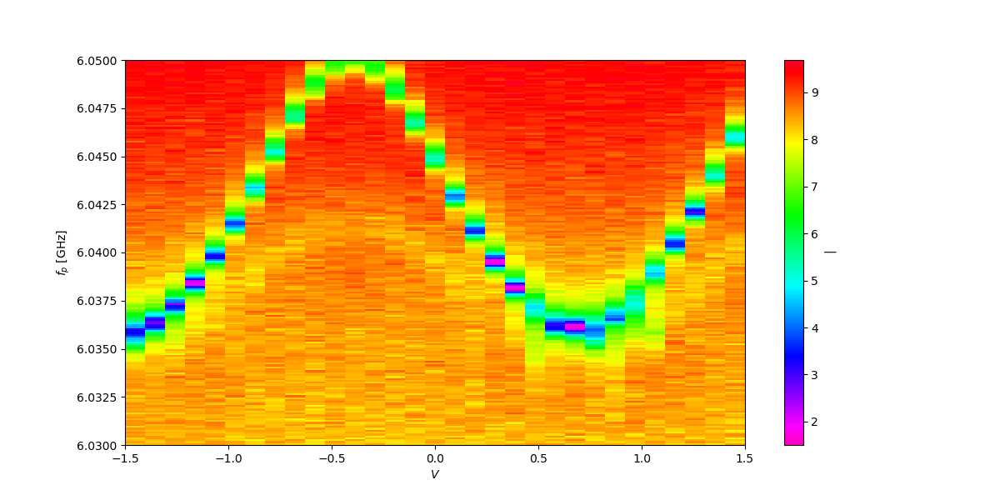
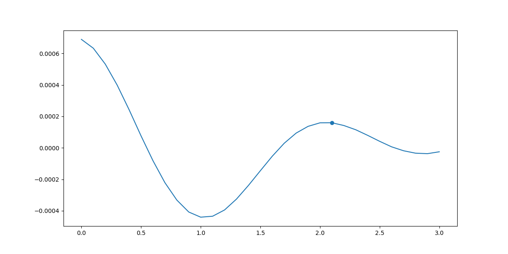
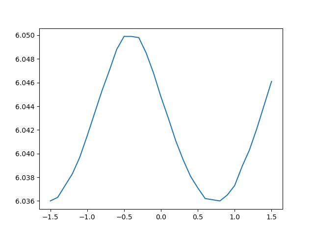
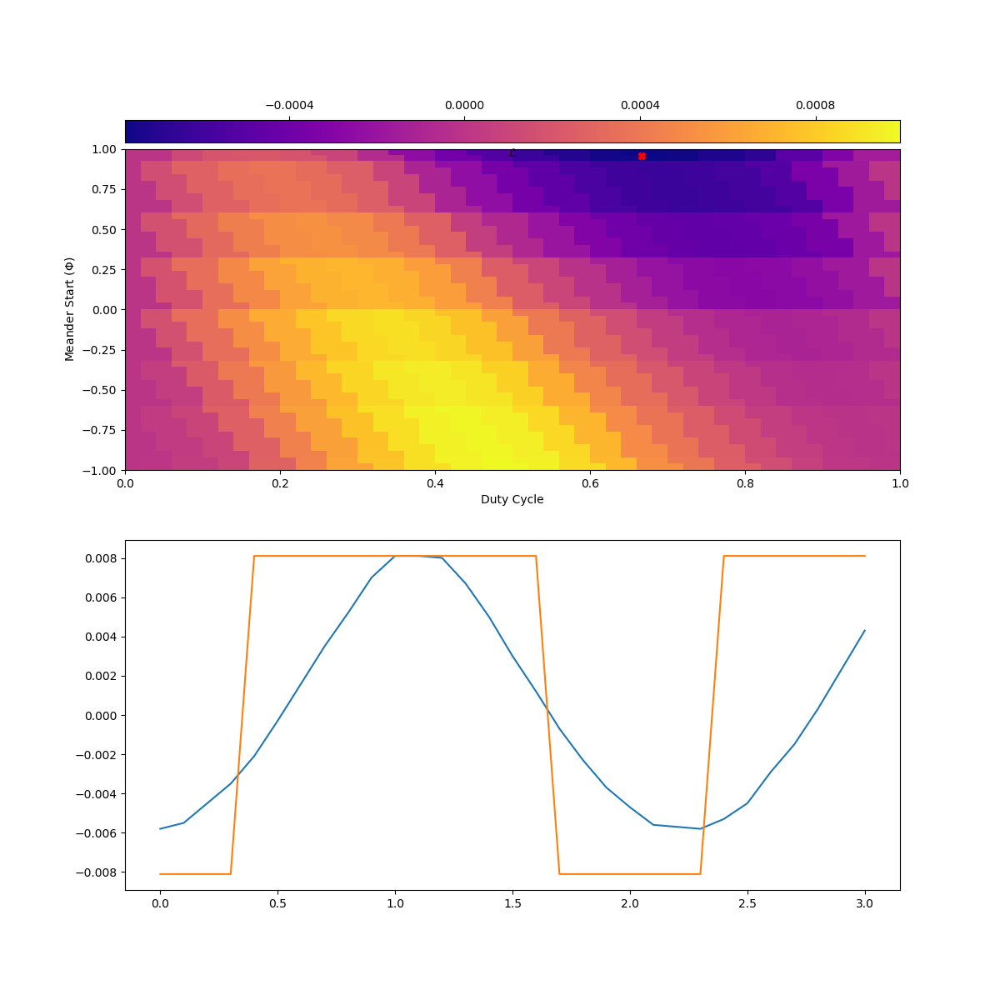
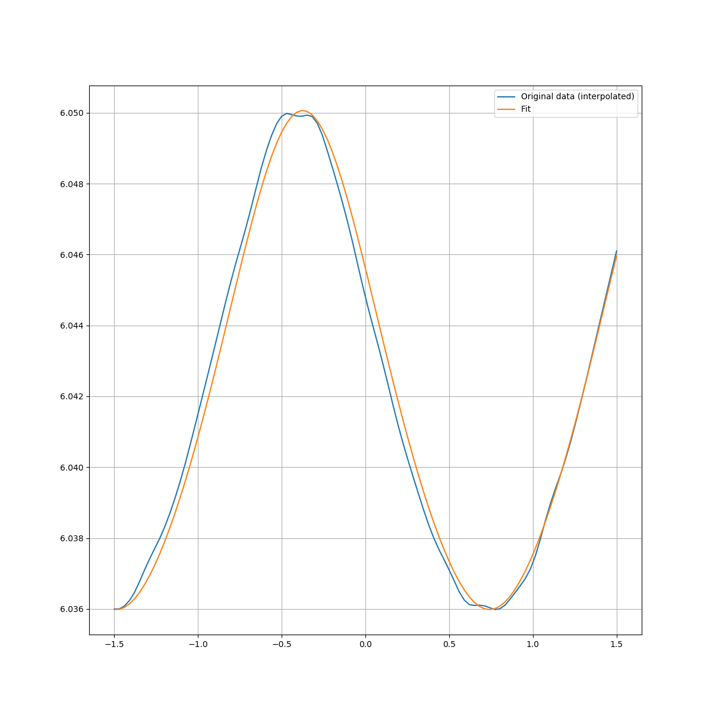

# Single-Tone-Spectroscopy
This is a python library which uses an OOP approach to automating STS data analysis. 
The STSSolution class implements a novel method of extracting the parameters by using
basinhopping. 

This library is based on the paper **Automated analysis of single-tone 
spectroscopic data for cQED systems**
G.P. Fedorov and A. V. Ustinov. A copy can be found in the references directory
on the page

## Overview of methods and parameters

In order to initialize an STSSolution object, all that is required is a path to a data
file that can be parsed by numpy into rows and columns of data. Optional parameters 
to the STSSolution constructor for frequency span and voltage span can be passed if the
file doesn't follow the naming convention which is given as an example in the data directory

**Once the STSSolution object is initialized the following parameters are determined**
- The upper sweet spot for voltage
- The period of the data
- The upper sweet spot frequency associated with the voltage

Here is an example of how to initialize an STSSolution object and check the values of the
sweet spot voltage and frequency (Note: these are guesses which are used to tune
the basinhopping model)

    from STS import STSSolution
    solution = STSSolution("data/AB40_S21vsFvsV_fr6.03_6.05_Pr-80_V-1.5_1.5_0.1_T0.084_Cav2_143704_mag.dat")
    
    print("The guessed voltage sweet spot is", solution.voltage_sweet_spot)
    print("The guessed frequency at the sweet spot is", solution.frequency_sweet_spot)
    
It may also be helpful to check the sweet spots against the raw data. Occasionally 
the sweet spot will be off by 1 period.

**Visualization is also built into the library using matplotlib**

Here is an example of how to visualize data, and what the results ought to look like

    fig = solution.visualize_data() #Produces magnitude of S21 againsts swept freq. and voltage
    plt.show()
    
 
    fig, ax = solution.visualize_autoCorrelation()
    plt.show()
 
 

The second plot shows the autocorrelation function and location of the
local maximum corresponding to the period of the contour in the first plot.
The first plot is the familiar single-tone-spectroscopy contour plot where
the minimum of the contour at each swept voltage, corresponds with a specfic frequency
which the STS Solution library stores in an array belonging to the class.

    # sol is an instance of STSSolution
    plt.plot(sol.volt_span, sol.minimum_frequencies)
    plt.show()
    
  

Viewing the STS measurement in this manner is especially useful because
the average over all frequencies corresponding to a delta function of those frequencies
about their average has an average of zero (Section B of the main paper). This delta 
function is then an ideal candidate to be autocorrelated to extract the period.

**In order to extract the sweet spot, a brute force computation is done to find the phase shift
and duty cycle**

The phase and duty cycle can be extracted by minimizing the zero-lag correlation function between
the delta function and a pulse-width modulated square pulse, over a matrix of values for phase 
and duty cycle. 

    #sol is an instance of STSSolution
    fig, axs = sol.visualize_duty_phi()
    plt.show()
    
  
 
The red dot indicates the location of the minimum of the loss function
The orange curve is the best fit PWM square pulse.  
 
The voltage sweet spot can be computed from the period, duty cycle and phase.

**Full model fit**

The primary function of this library is to extract the hamiltonian parameters 
for the cQED system. The parameters this library extracts are

1. fc      --> Cavity frequency in the bright state
2. fmax_ge --> Transmon frequency at sweet spot
3. d       --> Transmon asymmetry parameter
4. g       --> cavity-qubit coupling constant
5. PI      --> Period
6. V_s     --> Sweet spot voltage

These parameters are extracted by using a basin hopping algorithm to find the global minimum 
of a loss function given in the paper. The resulting extraction is the most time consuming
method to call, but should only take a maximum of two minutes to complete the computation.
The parameters can be extracted as follows

    #sol is an instance of the STSSolution class
    sol.extract_hamiltonian_params()
    
    print("The cavity frequency:", sol.fc_param)
    print("The transmon frequency:", sol.fmax_ge_param)
    print("The asymmetry parameter:", sol.d_param)
    print("The cavity-qubit coupling parameter:", sol.g_param)
    
The full model fit can be visualized as follows

    #sol is an instance of the STSSolution class
    sol.extract_hamiltonian_params() #<-- only needs to be called once per measurement
    
    plt.plot(sol.interp_volt_axis, \
        sol.interp_min_freq)
    
    plt.plot(sol.interp_volt_axis, sol.f_function(self.interp_volt_axis, sol.fc_param,
                                    sol.g_param, sol.fmax_ge_param, sol.d_param, 
                                    sol.period, sol.voltage_sweet_spot)
    
    plt.show()

